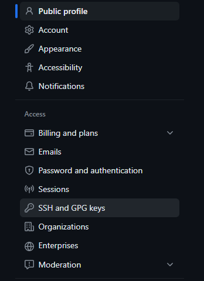

# Configuracion.

> git config --global user.name "usuario"

> git config --global user.email "correo"

## Ver configuracion general.

> git config --list

## Ver el nombre de usuario.

> git config user.name

## Ver el correo.

> git config user.email

## Conexion SSH

> ssh-keygen -t ed25519 -C "correo"

* NOTA: Se puede colocar una contraseña para mayhor seguridad o se puede colocar despues.

>  eval \`ssh-agent -s`

## Activamos llave publica. 

> ssh-add ~/.ssh/id_ed25519

## Copiar llave publica.

>  clip < ~/.ssh/id_ed25519.pub

## Configuramos llave en Git Hub.

1. Dentro de nuestra cuenta nos dirigimos a configuracion.

2. Nos dirigimos a SSH and GPG Keys.

3. Seleccionamos New SSH key.

4. Le asignamos un nombre.

5. Pegamos la llave copiada y le damos en agregar.

## Validar que se configuro la llave.

> ssh -T git@github.com

e