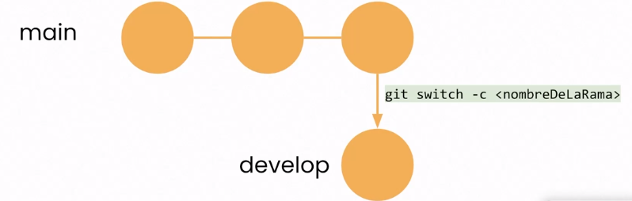

# Ramas.

## Crear una nueva rama.

> git switch -c "nombre rama"

## Ver que rtama existen.

> git branch

## Cambiar de rama

> git switch "nombre de la rama"

## Eliminar rama

> git branch -D "nombre de la rama"

## Unir ramas.

> git marge "nombre de la rama a unir"