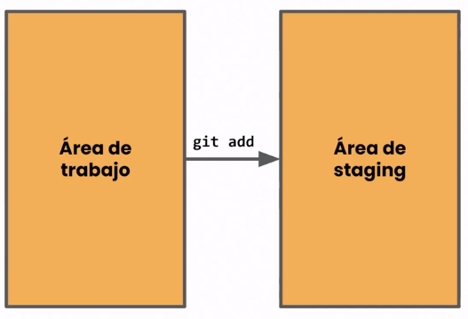
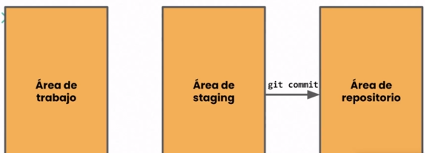
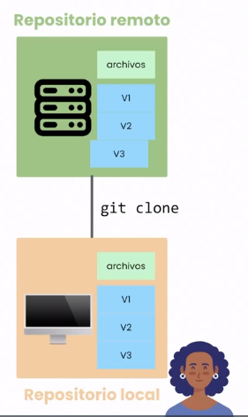

# Repositorios.

## Inicializar repositorio.

> git init

## Prepara cambios antes del commit.

## Agrergar todos los cambios.

> git add .

## Agregar cambios de un archivo especifico.

> git add "nombre del archivo"

## Agregar cambios solo en el area de trabajo.

> git add -A

## Agregar los cambios modificacios o eliminados.

> git add -u

## Devuelve cambios.

> git reset

# Commit

> git commit -m "mensaje"

# Push & Pull

> git remote add origin "url"

    Se utiliza para indicarle a git donde se encontra la ruta remota del repositorio.

> git push -u origin main

    Actualiza

> git pull 

    Actualiza nuestro repositotio local con las ultimas actualizacion que se encuentran en el servidor remoto.

# Copiar repositorio.

> git clone "url"

    Descarga copia completa del repositorio.