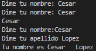

# Dia 1 

Curso de Udemy Python Total por Federico Garay.

## Print

    Es una funcion que nos permite mostrar en pantalla el contenido.

> print("texto")

``` python
# Mostrar en pantalla 

print("Hola mundo") # usando comillas sobles

print('Hola mundo') # usando comillas simples

print('Hola "mundo"') # para mostras comillas dobles en un texto

print("hola 'mundo'") # para mostrar comillas sensillas en texto

```
Mostrara en pantalla.
> 

## Strings

### Concadenar texto.

Se utiliza el signo de + para concadenar texto.

> print("texto"+"texto")

```python

print('100+50') # python lo interpreta como cadena de texto y no como una operacion de numeros.

print("Hola" + 'Cesar') # Concadenar string

print("Hola " + 'Cesar') # Espacio despues del 'Hola '

print("Hola" + ' Cesar') # Espacio antes de ' Cesar'

print('Hola'+' '+'Cesar') # Se crea una tercera cade con un espacio en blanco

```

Se muestra en pantalla.


### Escape de texto.

Utilizamos la barra invertida \ para realizar escapes de texto y estos puden ser.

> Para mostrar las comilla dobles hacemos el uso de \\" 

> Para realizar un salto de linea usamos \\n

> Para agregar tabulacion al inicio del texto usamos \\t

> Para mostrar una barra invertisa usamos \\\

``` python

print("Me llamo \"Cesar\"") # \" Muestra las comillas doble.

print("Esta es un alinea\nY esta es otra linea.") # \n hace salto de linea.

print("\tAgrega tabular") # \t Agrega un tabulado o 4 espacion al inicio.

print('This isn\'t a number') # \' se puede usar para mostrar la comilla en el texto 

print('Este signo \\ es una barra investida') # se utiliza doble barra invertida para mostrar una barra.

```
Se muestra en pantalla.


## input

    Es una funcion que le permite al usuario introducir informacion.

> input("texto de solicitud")

    El input por si solo no muestra ni almacena informacion es por eso que debemos hacer uso de otras funciones.

```python
input("Dime tu nombre: ") # Espera a que el usuario introdusca y precione enter para finalizar o cuntunuar.

print(input("Dime tu nombre: ")) # Muestra en pantalla lo que el usuario introduce.

print("Tu nombre es " + input("Dime tu nombre: ") + " " + input("Dime tu apellido: ")) # Concadena lo que introduce el usuario con una cadena de texto.

```
Se muestra en pantalla: 




