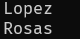
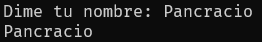

## Tipo de datos.

String(str) = Cadena de texto y debe de estar entre comillas

> "Cesar"   
> "DG!"#$%32dv"  
> "159635897"

Integer(int) = numeros enteros sin comillas

> -1987  
> 1987  
> <150

Floating(float) = numeros con decimales sin comillas

> 3.1416   
> -9878.3    
> 1.999999999

Lista(list) = cololeccion ordenada de objetos y se escribe entre corchetes []  

> ["manzana", "planato", "pera"]  
> [1987,"casa", "14-02-2024", true]  
> [1, 24, 36, -14]

Disccionario (dic) =su contenido se escribe entre llaves {}, y se agrupan en pares de palabras agrupadas, el cual es la clave y su valor.

> {"nombre":"Cesar", "edad":36, "genero":"masculino"}  
> {"fruta":"manzana", "verdura":"zanahoria"}

Tuples (tuple0) = Se escriben entre parentesis, parecido a la listas, cualquier tipo de dato, su orden es inmutables. 

> ("lunes","martes","miercoles","jueves","viernes")

sets(set) = conjunto de datos unicos, se escribe entre llaves.

> ['a','b','c']

Booleanos(bool) = Solo puede tener el valor de verdadero o falso, se usan para saber si una candicon se cumple.

> True  
> False

## Variables.

Declaracion de variables.

> <"nombre de la variable"> = <"Valor asignado">

``` py
# entero
edad = 36

#float
pi = 3.1416

# strings
nombre = "Cesar"

# booleano
aprobado = True

# Lista
lista = ["Cesar", "Nallely"]

#tuple
mitupla = ("lunes","martes","miercoles","jueves","viernes")

# diccionario
diccionario = {"nombre":"Cesar", "edad":36, "genero":"masculino"}

# set 
alfabeto = ['a','b','c']

```

A las varaible se les puede cambiar su valor surante la ejecucion. 

```py

# declaracion de variable 

apellido = "Lopez"
print(apellido)

# cambio de valor de variable
apellido = "Rosas"
print(apellido)

```
Se muestra en pnatalla.



Las variables se pueden sumar si son numeros.

```py
# suma de variables.
numero1 = 10
numero2 = 15
print(numero1+numero2)

```
Se muestra en pnatalla.


Se puede asignarle el valor de una variable desde un input.

> <"nombre variable"> = input("solicitud")

```py
nombre = input("Dime tu nombre: ")
print(nombre)

```

Se mostrara en pantalla.


